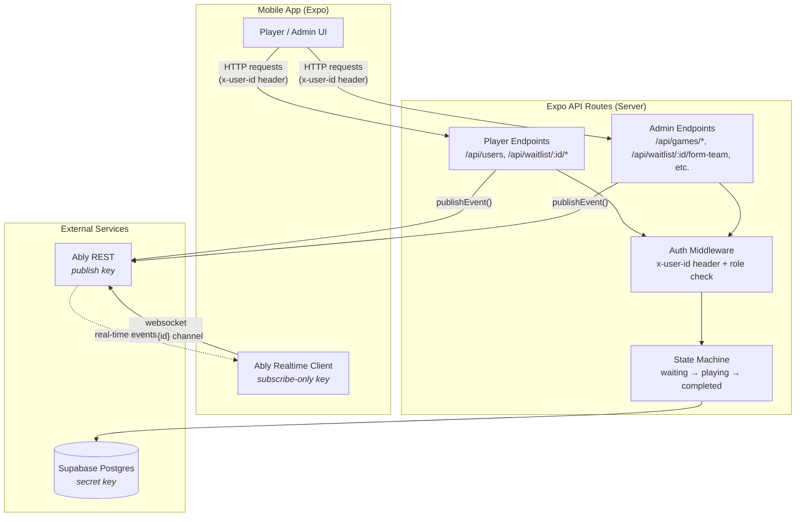
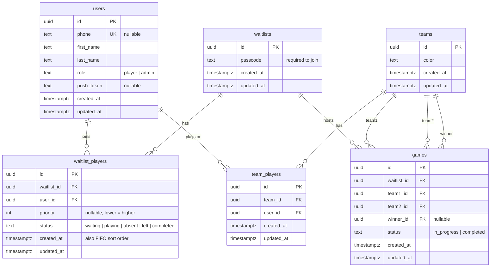
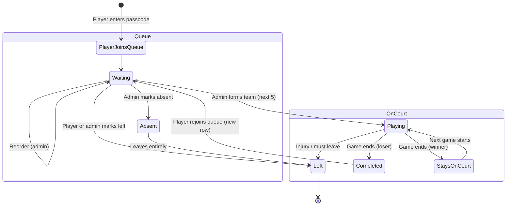

# Women's All Bball

A mobile app for organizing a community women's pickup basketball league. Players join a waitlist at the court, get auto-assigned to teams of 5, and cycle through games. Winning teams can stay on court.

Built with Expo (React Native), Supabase (Postgres), and Ably (real-time websockets).

## Prerequisites

- Node.js 18+
- [pnpm](https://pnpm.io/) (`npm install -g pnpm`)
- [Expo CLI](https://docs.expo.dev/get-started/installation/) (`npm install -g expo-cli`)
- A [Supabase](https://supabase.com/) project (free tier works)
- An [Ably](https://ably.com/) account (free tier works)
- iOS Simulator, Android Emulator, or [Expo Go](https://expo.dev/go) on a physical device

## Setup

### 1. Install dependencies

```bash
pnpm install
```

### 2. Configure environment variables

```bash
cp .env.local.example .env.local
```

Edit `.env.local` with your actual values:

```
# Server-only
SUPABASE_URL=https://your-project.supabase.co
SUPABASE_SECRET_KEY=sb_secret_your-secret-key
ABLY_API_KEY=your-ably-api-key

# Client-safe
EXPO_PUBLIC_ABLY_SUBSCRIBE_KEY=your-ably-subscribe-only-key
```

Server-only vars (no `EXPO_PUBLIC_` prefix) are never bundled into the client. The Ably subscribe key is safe to expose — it can only subscribe, not publish.

**Where to find these:**

- **Supabase URL**: Supabase Dashboard > Project Settings > API
- **Supabase Secret Key**: Supabase Dashboard > Project Settings > API Keys > Create a Secret Key (`sb_secret_...`). This replaces the legacy `service_role` key.
- **Ably API Key**: Ably Dashboard > Your App > API Keys. Use a key with publish + subscribe for the server.
- **Ably Subscribe Key**: Ably Dashboard > Your App > API Keys. Create a key with subscribe-only capability for the client.

### 3. Set up the database

#### Option A: Using the Supabase CLI (recommended)

```bash
# Install the Supabase CLI
brew install supabase/tap/supabase

# Log in to your Supabase account
supabase login

# Link to your remote project (find your project ref in Dashboard > Project Settings > General)
supabase link --project-ref your-project-ref

# Push the migration to your remote database
supabase db push
```

This reads from `supabase/migrations/` and applies any pending migrations.

To check migration status:

```bash
# See which migrations have been applied
supabase migration list
```

To reset the remote database (destructive — useful during development):

```bash
supabase db reset --linked
```

#### Option B: Manual SQL

1. Go to your Supabase Dashboard > SQL Editor
2. Paste the contents of `supabase/migrations/001_initial_schema.sql`
3. Run it

Both options create all tables, indexes, constraints, and triggers.

### 4. Create an admin user

After the schema is set up, create your first admin user directly in the Supabase Table Editor or SQL Editor:

```sql
INSERT INTO users (first_name, last_name, phone, role)
VALUES ('Your', 'Name', '1234567890', 'admin');
```

Admin role is managed directly in the database. To promote an existing user:

```sql
UPDATE users SET role = 'admin' WHERE phone = '1234567890';
```

### 5. Create a waitlist

Each session/day at the court should have its own waitlist with a unique passcode:

```sql
INSERT INTO waitlists (passcode) VALUES ('HOOP');
```

The passcode is displayed at the court so only players physically present can join.

## Running the app

```bash
pnpm start
```

Then press:

- `i` to open on iOS Simulator
- `a` to open on Android Emulator
- Scan the QR code with Expo Go on a physical device

## API Endpoints

All API routes are served by Expo Router's API routes from `src/app/(api)/`.

Requests should include a `x-user-id` header with the user's UUID for identification. Admin endpoints additionally verify `users.role = 'admin'`.

### Player endpoints

| Method | Endpoint                   | Description                                                          |
| ------ | -------------------------- | -------------------------------------------------------------------- |
| POST   | `/api/users`               | Register or update a user. Body: `{ first_name, last_name, phone? }` |
| GET    | `/api/waitlist/:id`        | View the waitlist: queue, active game, up next                       |
| POST   | `/api/waitlist/:id/join`   | Join the waitlist. Body: `{ passcode }`                              |
| POST   | `/api/waitlist/:id/leave`  | Leave the waitlist (waiting/absent players only)                     |
| POST   | `/api/waitlist/:id/rejoin` | Rejoin the queue after a game (creates new row at end)               |

### Admin endpoints (require `role = 'admin'`)

| Method | Endpoint                        | Description                                                                                             |
| ------ | ------------------------------- | ------------------------------------------------------------------------------------------------------- |
| POST   | `/api/waitlist/:id/add-player`  | Add a player to the waitlist. Body: `{ user_id }` or `{ first_name, last_name }`                        |
| POST   | `/api/waitlist/:id/reorder`     | Reorder the queue. Body: `{ player_ids: [...] }` (ordered list from drag-and-drop)                      |
| POST   | `/api/waitlist/:id/mark-absent` | Mark player absent, swap in next from queue. Body: `{ waitlist_player_id, team_id? }`                   |
| POST   | `/api/waitlist/:id/mark-left`   | Mark player as left. Body: `{ waitlist_player_id, team_id? }` (team_id triggers replacement if playing) |
| POST   | `/api/waitlist/:id/form-team`   | Form a team from the next 5 in queue. Auto-assigns color.                                               |
| POST   | `/api/games`                    | Start a game. Body: `{ waitlist_id, team1_id, team2_id }`                                               |
| GET    | `/api/games/:id`                | View a game with teams, players, and winner                                                             |
| POST   | `/api/games/:id/complete`       | End a game. Body: `{ winner_id }`. Losing team marked completed.                                        |
| POST   | `/api/games/:id/keep-team`      | Winning team stays on court. Body: `{ dropped_user_ids?: [...] }` (handles replacements)                |
| POST   | `/api/games/:id/next-game`      | Start next game. Body: `{ staying_team_id }`. Forms challenger team from queue.                         |

## Architecture



### Entity Relationship Diagram



### Game Flow



## Data Model

### Queue ordering

Players are ordered by `priority ASC NULLS LAST, created_at ASC`. Most players have `null` priority and sort by join time (FIFO). When an admin reorders via drag-and-drop, all waiting players get explicit priorities (1, 2, 3, ...). New players joining after a reorder get `null` priority and sort to the end.

### Waitlist player states

```
waiting  --> playing      (formed into a team)
waiting  --> absent       (staff marks absent)
waiting  --> left         (player leaves or staff marks left)
absent   --> left         (absent player leaves entirely)
playing  --> completed    (game ends)
playing  --> left         (injury or player must leave mid-game)
```

- Rows are **never deleted**. Status changes only. This preserves full history.
- A user can only have **one active row** (waiting/playing/absent) per waitlist at a time.
- Rejoining creates a **new row**, so the old `completed` row stays as history.

### Team colors

Colors are auto-assigned from a predefined list, skipping any color currently in use by an active game. Available colors: Red, Blue, Green, Yellow, Purple, Orange, Pink, White, Black, Gray.

## Real-time updates

The app uses [Ably](https://ably.com/) for real-time updates via websockets. Every mutation endpoint publishes an event to an Ably channel (`waitlist:{id}`). Clients subscribe to this channel and refresh their data when events arrive. Pull-to-refresh is available as a fallback.

The server uses `ABLY_API_KEY` (with publish capability) to send events. The client uses `EXPO_PUBLIC_ABLY_SUBSCRIBE_KEY` (subscribe-only) to listen — this key is safe to expose since it cannot publish or modify anything.

## Project structure

```
src/
  app/
    (api)/
      users+api.ts                    # User registration
      games+api.ts                    # Create game
      games/[id]+api.ts               # View game
      games/[id]/complete+api.ts      # End game
      games/[id]/keep-team+api.ts     # Keep winning team
      games/[id]/next-game+api.ts     # Start next game
      waitlist/[id]+api.ts            # View waitlist
      waitlist/[id]/join+api.ts       # Join queue
      waitlist/[id]/leave+api.ts      # Leave queue
      waitlist/[id]/rejoin+api.ts     # Rejoin queue
      waitlist/[id]/add-player+api.ts # Admin: add player
      waitlist/[id]/reorder+api.ts    # Admin: reorder queue
      waitlist/[id]/mark-absent+api.ts# Admin: mark absent
      waitlist/[id]/mark-left+api.ts  # Admin: mark left
      waitlist/[id]/form-team+api.ts  # Admin: form team
    index.tsx                         # Home screen
    _layout.tsx                       # Root layout
  lib/
    supabase.ts                       # Supabase client
    ably.ts                           # Ably server-side publish
    ably-client.ts                    # Ably client-side subscribe
    waitlist.ts                       # Queue queries, state machine
    auth.ts                           # User ID extraction, admin check
  components/                         # Reusable UI components
  constants/                          # Theme, colors, spacing
  hooks/                              # Custom React hooks
supabase/
  migrations/
    001_initial_schema.sql            # Database schema
```

## Deployment

This app is designed to be deployed with [EAS (Expo Application Services)](https://docs.expo.dev/eas/):

```bash
# Install EAS CLI
npm install -g eas-cli

# Log in to your Expo account
eas login

# Configure the project
eas build:configure

# Build for iOS
eas build --platform ios

# Build for Android
eas build --platform android
```

See the [EAS Build docs](https://docs.expo.dev/build/introduction/) for full details.
