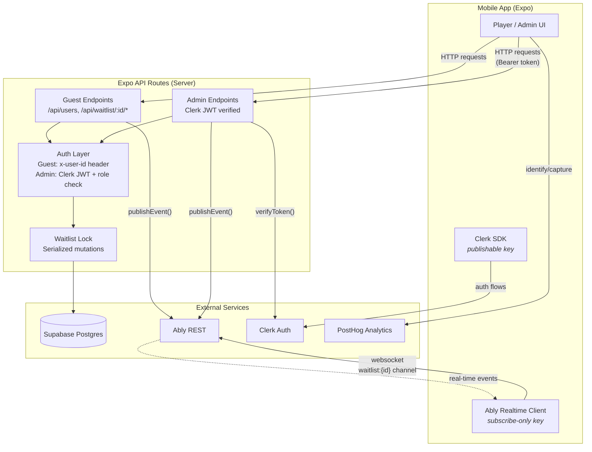
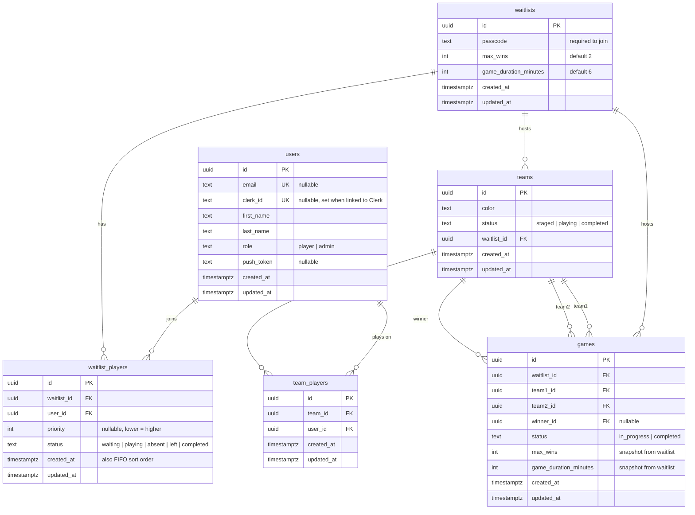
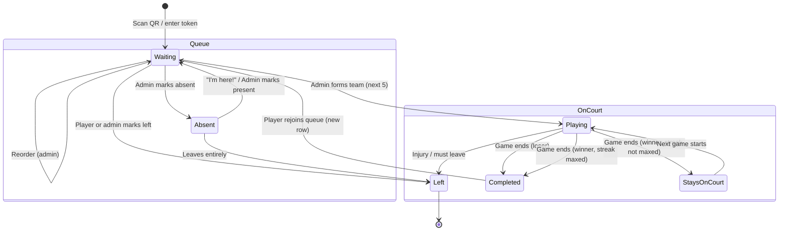

# Women's All B-Ball

A mobile app for organizing a community women's pickup basketball league. Players join a waitlist at the court, get auto-assigned to teams of 5, and cycle through games. Winning teams can stay on court.

Built with Expo (React Native), Supabase (Postgres), Ably (real-time websockets), Clerk (authentication for full accounts), and PostHog (analytics).

## Prerequisites

- Node.js 18+
- [pnpm](https://pnpm.io/) (`npm install -g pnpm`)
- [Expo CLI](https://docs.expo.dev/get-started/installation/) (`npm install -g expo-cli`)
- A [Supabase](https://supabase.com/) project (free tier works)
- An [Ably](https://ably.com/) account (free tier works)
- A [Clerk](https://clerk.com/) application (free tier works) — only needed for admin/full account features
- iOS Simulator, Android Emulator, or [Expo Go](https://expo.dev/go) on a physical device

## Setup

### 1. Install dependencies

```bash
pnpm install
```

### 2. Configure environment variables

```bash
cp .env.local.example .env.local
```

Edit `.env.local` with your actual values:

```
# Server-only
SUPABASE_URL=https://your-project.supabase.co
SUPABASE_SECRET_KEY=sb_secret_your-secret-key
ABLY_API_KEY=your-ably-api-key
CLERK_SECRET_KEY=sk_test_your-clerk-secret-key

# Client-safe
EXPO_PUBLIC_ABLY_SUBSCRIBE_KEY=your-ably-subscribe-only-key
EXPO_PUBLIC_CLERK_PUBLISHABLE_KEY=pk_test_your-clerk-publishable-key
```

Server-only vars (no `EXPO_PUBLIC_` prefix) are never bundled into the client.

**Where to find these:**

- **Supabase URL / Secret Key**: Supabase Dashboard > Project Settings > API
- **Ably API Key**: Ably Dashboard > Your App > API Keys. Use a key with publish + subscribe for the server.
- **Ably Subscribe Key**: Ably Dashboard > Your App > API Keys. Create a key with subscribe-only capability for the client.
- **Clerk Keys**: Clerk Dashboard > API Keys. The publishable key is client-safe; the secret key is server-only.

### 3. Set up the database

#### Option A: Using the Supabase CLI (recommended)

```bash
# Install the Supabase CLI
brew install supabase/tap/supabase

# Log in to your Supabase account
supabase login

# Link to your remote project (find your project ref in Dashboard > Project Settings > General)
supabase link --project-ref your-project-ref

# Push the migration to your remote database
supabase db push
```

This reads from `supabase/migrations/` and applies any pending migrations.

#### Option B: Manual SQL

1. Go to your Supabase Dashboard > SQL Editor
2. Run each migration file in `supabase/migrations/` in order (001, 002, ..., 008)

### 4. Configure Clerk

In your Clerk Dashboard:

1. **Configure > Email, Phone, Username** — Enable Email address, disable "Verify at sign-up"
2. **Configure > Authentication** — Enable Password

Clerk is only required for full account features (admin access, future discussion features). Guest users don't interact with Clerk at all.

### 5. Create an admin user

1. Register as a guest in the app (enter your name)
2. In the app, go to **Settings > Link Full Account** and create a Clerk account
3. Promote yourself to admin via SQL:

```sql
UPDATE users SET role = 'admin' WHERE email = 'your@email.com';
```

Or use the app's admin panel to promote other users after your first admin is set up.

### 6. Create a waitlist

Admins create waitlists from the **Settings** tab in the app. Each session at the court gets its own waitlist with an auto-generated passcode.

## Running the app

```bash
pnpm start
```

Then press:

- `i` to open on iOS Simulator
- `a` to open on Android Emulator
- `w` to open in a web browser
- Scan the QR code with Expo Go on a physical device

## Authentication Model

The app has a two-tier authentication system:

### Guest users

- Register with just a first name and last name (email optional)
- Stored in Supabase `users` table with `clerk_id = null`
- Identified by `x-user-id` header (client-set, not cryptographically verified)
- Can join waitlists, play games, and view all content
- Account is tied to the device's local storage

### Full users (Clerk-linked)

- Guest users can promote to full accounts via **Settings > Link Full Account**
- Creates a Clerk account (email + password) and links `clerk_id` to the existing Supabase user
- Admin endpoints require a verified Clerk JWT (`Authorization: Bearer <token>`)
- Server verifies JWTs via `verifyToken` from `@clerk/backend`
- Clerk email is synced to the Supabase user record on linking

### What requires which auth level

| Action                      | Auth level                      |
| --------------------------- | ------------------------------- |
| View waitlist, queue, games | None (read-only guest browsing) |
| Join/leave waitlist         | Guest (x-user-id)               |
| Update own profile          | Guest (x-user-id)               |
| Link Clerk account          | Clerk JWT (verified)            |
| Delete linked account       | Clerk JWT (verified)            |
| All admin actions           | Clerk JWT + admin role          |

## API Endpoints

All API routes are served by Expo Router's API routes from `src/app/api/`.

### User endpoints

| Method | Endpoint                  | Description                                                                                                           |
| ------ | ------------------------- | --------------------------------------------------------------------------------------------------------------------- |
| POST   | `/api/users`              | Register a guest user. Body: `{ first_name, last_name, email? }`. With Clerk JWT + `clerk_id`, creates a linked user. |
| GET    | `/api/users/:id`          | View user profile                                                                                                     |
| PATCH  | `/api/users/:id`          | Update profile (self), link Clerk account (JWT required), or change role (admin)                                      |
| DELETE | `/api/users/:id`          | Anonymize account. Linked accounts require Clerk JWT; guest accounts use x-user-id.                                   |
| GET    | `/api/users?clerk_id=xxx` | Look up user by Clerk ID (requires JWT proving ownership)                                                             |
| GET    | `/api/users?q=name`       | Search users by name (admin only)                                                                                     |
| GET    | `/api/users?role=admin`   | List admins (admin only)                                                                                              |

### Player endpoints

| Method | Endpoint                         | Description                                                               |
| ------ | -------------------------------- | ------------------------------------------------------------------------- |
| GET    | `/api/waitlist/:id`              | View the waitlist: queue, active game, up next, streak info               |
| POST   | `/api/waitlist/:id/join`         | Join the waitlist. Body: `{ passcode }`. Returning players skip passcode. |
| POST   | `/api/waitlist/:id/join-token`   | Join via a time-limited token. Body: `{ token }`                          |
| POST   | `/api/waitlist/:id/leave`        | Leave the waitlist (waiting/absent players only)                          |
| POST   | `/api/waitlist/:id/mark-present` | Mark yourself present (self-service for absent players, or admin via JWT) |
| GET    | `/api/games`                     | List completed games with team details, paginated                         |

### Admin endpoints (require Clerk JWT + admin role)

| Method | Endpoint                        | Description                                                      |
| ------ | ------------------------------- | ---------------------------------------------------------------- |
| POST   | `/api/waitlist`                 | Create a new waitlist with auto-generated passcode               |
| PATCH  | `/api/waitlist/:id`             | Update settings (max_wins, game_duration_minutes)                |
| POST   | `/api/waitlist/:id/token`       | Generate a time-limited join token                               |
| POST   | `/api/waitlist/:id/add-player`  | Add a player. Body: `{ user_id }` or `{ first_name, last_name }` |
| POST   | `/api/waitlist/:id/reorder`     | Reorder the queue. Body: `{ player_ids: [...] }`                 |
| POST   | `/api/waitlist/:id/form-team`   | Form a team from the next 5 in queue                             |
| POST   | `/api/waitlist/:id/mark-absent` | Mark player absent. Body: `{ waitlist_player_id, team_id? }`     |
| POST   | `/api/waitlist/:id/mark-left`   | Mark player as left. Body: `{ waitlist_player_id, team_id? }`    |
| POST   | `/api/games/:id/complete`       | End a game. Body: `{ winner_id }`                                |

## How It Works

### Player Experience

1. **Browse** — Open the app to see the current waitlist, queue, and game on court. No account needed.
2. **Join** — Tap "Scan QR Code to Join" or enter a token. You'll be prompted to enter your name (guest registration). Email is optional.
3. **Wait in the queue** — See your position, who's up next, and the current game. Live updates via Ably websockets.
4. **Play** — When you're in the next 5, you'll be formed into a team and assigned a color automatically.
5. **After the game** — Lost: you're moved to completed and can rejoin at the end of the queue. Won: you may stay on court (depending on streak rules).
6. **If you're marked absent** — You stay in the queue but are skipped. Tap "I'm here!" to mark yourself present.
7. **Link your account** — Optionally go to Settings > Link Full Account to create a Clerk account (email + password) for admin features or future discussion features.

### Staff Workflow

```
Form Team (x2) -> Start Game -> Tap Winner -> End Game -> (auto) -> Start Game -> ...
```

**Before games start:**

1. Open the **Settings** tab to view/create waitlists and manage the QR code
2. Toggle **max wins** (2 or 3) and **game duration** (5 or 6 min) based on player count
3. Show the QR code for players to scan

**Game cycle (3 taps):** Tap winner -> End Game -> Start Game.

- **Streak not maxed:** Losing team rotates off. The system auto-keeps the winner and forms a new challenger from the queue.
- **Streak maxed:** Both teams rotate off. Tap "Form Team" twice to create two new teams.

**Managing the queue (Edit mode):**

- Tap **"Edit"** next to "Up Next" to show admin controls
- **Absent** — player is skipped but stays in the queue
- **Present** — marks an absent player as back
- **Left** — removes a player from the queue

## Architecture



### Entity Relationship Diagram



### Player State Machine



## Data Model

### Queue ordering

Players are ordered by `priority ASC NULLS LAST, created_at ASC`. Most players have `null` priority and sort by join time (FIFO). When an admin reorders via drag-and-drop, all waiting players get explicit priorities (1, 2, 3, ...). New players joining after a reorder get `null` priority and sort to the end.

### Waitlist player states

```
waiting  --> playing      (formed into a team)
waiting  --> absent       (staff marks absent)
waiting  --> left         (player leaves or staff marks left)
absent   --> left         (absent player leaves entirely)
absent   --> waiting      (player marks present or staff marks present)
playing  --> completed    (game ends)
playing  --> left         (injury or player must leave mid-game)
```

- Rows are **never deleted**. Status changes only. This preserves full history.
- A user can only have **one active row** (waiting/playing/absent) per waitlist at a time.
- Rejoining creates a **new row**, so the old `completed` row stays as history.

### Streak system

- Winning team stays on court (up to `max_wins` consecutive wins)
- When streak is maxed, both teams rotate off and 10 new players are needed
- After a streak reset, the next winner stays on and only 5 new players are needed
- Streak is tracked by `team_id` across completed games
- The `upNextCount` (5 or 10) is computed per request based on whether the streak team is still active

### Team colors

Colors are auto-assigned from a predefined list, skipping any color currently in use by an active game. Available colors: Red, Blue, Green, Yellow, Purple, Orange, Pink, White, Black, Gray.

## Real-time updates

The app uses [Ably](https://ably.com/) for real-time updates via websockets. Every mutation endpoint publishes an event to an Ably channel (`waitlist:{id}`). Clients subscribe and refresh their data when events arrive. Pull-to-refresh is available as a fallback.

## Project structure

```
src/
  app/
    api/
      users+api.ts                    # User registration, search, lookup
      users/[id]+api.ts               # Profile, linking, deletion
      games+api.ts                    # List games
      games/[id]+api.ts               # View game
      games/[id]/complete+api.ts      # End game
      waitlist+api.ts                 # List/create waitlists
      waitlist/[id]+api.ts            # View waitlist details
      waitlist/[id]/join+api.ts       # Join queue (passcode)
      waitlist/[id]/join-token+api.ts # Join queue (token)
      waitlist/[id]/token+api.ts      # Generate join token (admin)
      waitlist/[id]/leave+api.ts      # Leave queue
      waitlist/[id]/add-player+api.ts # Admin: add player
      waitlist/[id]/reorder+api.ts    # Admin: reorder queue
      waitlist/[id]/mark-absent+api.ts# Admin: mark absent
      waitlist/[id]/mark-present+api.ts# Self/admin: mark present
      waitlist/[id]/mark-left+api.ts  # Admin: mark left
      waitlist/[id]/form-team+api.ts  # Admin: form team
    _layout.tsx                       # Root layout (Clerk, PostHog, UserProvider, AuthGate)
    index.tsx                         # Home screen
    games.tsx                         # Games history tab
    rules.tsx                         # Format & rules
    culture.tsx                       # Etiquette & culture
    settings.tsx                      # Profile, admin tools, account linking
  lib/
    supabase.ts                       # Supabase client (server-side, service key)
    ably.ts                           # Ably server-side publish
    ably-client.ts                    # Ably client-side subscribe
    waitlist.ts                       # Queue queries, state transitions
    auth.ts                           # getUserId, requireAdmin (JWT), isAdmin (JWT)
    api.ts                            # Client-side API functions
    user-context.tsx                  # User state (local storage based)
    auth-gate-context.tsx             # Guest registration + Clerk sign-in modal
    user-store.ts                     # SecureStore/localStorage persistence
    posthog.ts                        # PostHog client
    posthog-server.ts                 # PostHog server-side
  components/
    screens/
      home.tsx                        # Main waitlist/queue/game view
      games.tsx                       # Games history list
      auth.tsx                        # Clerk sign-in/sign-up (for account linking)
    app-tabs.tsx                      # Native tab navigation
    app-tabs.web.tsx                  # Web tab navigation
    game-card.tsx                     # Active game display
    game-result-card.tsx              # Completed game card
    team-view.tsx                     # Team display with player list
    queue-item.tsx                    # Queue row with status badges
    join-section.tsx                  # QR scan / token entry
    join-qr-code.tsx                  # QR code display (admin)
  services/
    orchestrator.ts                   # Game lifecycle (form team, start game, declare winner)
    game-service.ts                   # Game creation and winner declaration
    team-service.ts                   # Team formation and color assignment
    queue-service.ts                  # Queue join/leave/reorder
    streak.ts                         # Win streak calculation
    lock.ts                           # Advisory lock for serialized mutations
  constants/
    theme.ts                          # Colors, spacing, fonts
    team-colors.ts                    # Team color definitions
    passcodes.ts                      # Passcode word list
  hooks/
    use-waitlist.ts                   # Waitlist data + actions
    use-games.ts                      # Games history with streak computation
    use-ably-channel.ts               # Ably subscription hook
    use-join-deeplink.ts              # Deep link join handler
    use-theme.ts                      # Theme hook
supabase/
  migrations/
    001_initial_schema.sql            # Core tables
    ...
    008_clerk_id.sql                  # Clerk integration + phone->email migration
```

## Deployment

This app is designed to be deployed with [EAS (Expo Application Services)](https://docs.expo.dev/eas/):

```bash
# Install EAS CLI
npm install -g eas-cli

# Log in to your Expo account
eas login

# Configure the project
eas build:configure

# Build for iOS
eas build --platform ios

# Build for Android
eas build --platform android
```

See the [EAS Build docs](https://docs.expo.dev/build/introduction/) for full details.
